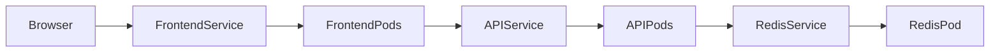

# eks-lab-app

Primeira fase de um laboratório para estudar EKS, troubleshooting e DevOps.
Frontend estático + FastAPI + Redis, acessados exclusivamente por `kubectl port-forward`.
Repositório: `willsreis/eks-lab-app`, localizado em `sites/eks-lab-app`.

**Alvo:** cluster existente `eks-lab-dev`, região `us-east-1`, namespace `lab-dev`.
A infraestrutura e seu Terraform ficam fora deste repositório. O cluster está desligado;
o deploy e a validação real no EKS serão feitos quando ele estiver disponível.

**CI/CD preparado:** consulte [Deploy com GitHub Actions, ECR e OIDC](docs/github-actions-eks.md)
para configurar as roles, variáveis, runner e acesso ao namespace. O CI roda sem AWS em PRs/pushes;
publicação e deploy são manuais, com deploy desabilitado por padrão enquanto o cluster está desligado.

## Arquitetura



O diagrama representa as relações lógicas. No acesso desta fase, `kubectl port-forward svc/frontend`
seleciona um Pod do Service e encaminha a conexão a ele; não testa o caminho pelo ClusterIP do frontend.
O Nginx desse Pod encaminha `/api/*` ao Service `api:8000`. A API acessa `redis:6379`.
Essas duas conexões internas usam Services e DNS do cluster. O navegador só conhece `localhost:8080`;
não precisa resolver nomes Kubernetes nem usar CORS.

| Recurso | Réplicas | Porta do Service → container |
|---|---:|---|
| Deployment + Service `frontend` | 2 | 80 → 8080 |
| Deployment + Service `api` | 2 | 8000 → 8000 |
| Deployment + Service `redis` | 1 | 6379 → 6379 |

Todos os Services são `ClusterIP`. O único objeto com escopo global é o Namespace solicitado.
Os controladores criam ReplicaSets, Pods e EndpointSlices automaticamente.
Não há LoadBalancer, Ingress, Gateway, TLS, PVC, StatefulSet, HPA, NetworkPolicy,
instrumentação OpenTelemetry ou stack de observabilidade. O pipeline de deploy é descrito no guia acima.

## Estrutura

```text
.
├── README.md
├── .gitignore
├── .github/workflows/{ci.yml,deploy.yml}
├── docs/
│   ├── github-actions-eks.md
│   └── aws/{github-trust-policy.json,publish-policy.json,deploy-policy.json}
├── frontend/
│   ├── Dockerfile
│   ├── .dockerignore
│   ├── entrypoint.sh
│   ├── nginx.conf.template
│   └── public/{index.html,styles.css,app.js}
├── api/
│   ├── Dockerfile
│   ├── .dockerignore
│   ├── requirements.txt
│   ├── requirements-dev.txt
│   ├── app/{__init__.py,main.py}
│   └── tests/{test_api.py,smoke.py}
├── k8s/
│   ├── bootstrap/github-actions-rbac.yaml
│   ├── base/
│   │   ├── namespace.yaml
│   │   ├── kustomization.yaml
│   │   ├── frontend/{deployment.yaml,service.yaml,kustomization.yaml}
│   │   ├── api/{deployment.yaml,service.yaml,kustomization.yaml}
│   │   └── redis/{deployment.yaml,service.yaml,kustomization.yaml}
│   └── overlays/dev/kustomization.yaml
└── scripts/
    ├── {deploy.sh,destroy.sh,status.sh,port-forward.sh}
    ├── render-deploy.py
    ├── requirements.txt
    ├── tests/test_render_deploy.py
    └── ci/{install-kubectl.sh,smoke-docker.sh,smoke-eks.sh}
```

## Conceitos utilizados

| Conceito | Papel neste laboratório |
|---|---|
| Namespace | Agrupa os recursos em `lab-dev`; sozinho não isola a rede. |
| Deployment | Declara a versão e quantidade desejada de Pods; coordena atualizações. |
| ReplicaSet | Criado pelo Deployment para manter o número de réplicas. |
| Pod | Unidade de execução; aqui contém um único container. Seu nome/IP pode mudar. |
| Service | Oferece um endereço estável para os Pods selecionados. |
| ClusterIP | Tipo de Service com IP interno, sem exposição pública. |
| replicas | Quantidade desejada de Pods: frontend 2, API 2, Redis 1. |
| labels | Identificam os componentes e sua associação a esta aplicação. |
| selectors | Associam Deployments e Services aos Pods com labels correspondentes. |
| Kustomize | Combina a base com configurações do ambiente, sem templates externos. |

```text
Deployment → ReplicaSet → Pods
Service → Endpoints / EndpointSlices → Pods prontos
```

## API e comportamento esperado

| Endpoint GET | Comportamento |
|---|---|
| `/health` | HTTP 200, `{"status":"healthy"}`; não depende do Redis. |
| `/ready` | HTTP 200 com Redis acessível; HTTP 503 se indisponível. |
| `/api/info` | Serviço, versão, Pod, namespace, horário UTC, estado do Redis e requests. |
| `/api/cache` | Incrementa atomicamente um contador compartilhado no Redis. |
| `/api/cache?increment=false` | Consulta o contador Redis sem incrementá-lo. |
| `/api/error` | HTTP 500 intencional, com explicação em JSON. |
| `/api/slow?seconds=3` | Espera assíncrona; aceita inteiros de 1 a 10, padrão 3. |
| `/api/cpu?seconds=2` | Carga por 1 a 5 segundos de relógio, padrão 2; uma execução por Pod. |

Parâmetros fora dos limites retornam 422. CPU simultânea no mesmo Pod retorna 429;
o limite é por Pod e o endpoint não é um gerador infinito. A rota roda em uma thread,
mantendo o event loop disponível. A limitação de CPU do container pode reduzir o trabalho realizado.

`requests` conta chamadas `/api/*` atendidas pelo processo, incluindo erros e a própria consulta
a `/api/info`. Probes ficam de fora. Reiniciar o Pod zera esse contador, e réplicas têm valores diferentes.
O contador de `/api/cache` é separado e compartilhado. Redis não tem persistência: reinícios
do processo ou recriação do Pod perdem os dados. `Recreate` evita dois Redis independentes durante updates.
GET com incremento foi mantido como exercício; não é um padrão de API para dados de produção.

O frontend consulta `/api/info` ao abrir e ao clicar em **Normal Request**, sem polling oculto.
Os demais botões mostram seus próprios resultados, preservando os cartões da última consulta de informações.
O HTTP 500 intencional não significa que a API morreu. Logs de acesso ficam em stdout/stderr.

`startupProbe` permite a inicialização. `livenessProbe` testa o processo; `readinessProbe`
da API testa Redis. Se Redis cair, as APIs ficam não prontas e saem dos endpoints de tráfego,
mas continuam vivas. Nesse caso o frontend pode mostrar 502; consulte diretamente um Pod
para diagnosticar `/api/info` e `/ready`.

## Configuração e recursos

| Container | Variável | Padrão / origem |
|---|---|---|
| API | `APP_VERSION` | `1.0.0` |
| API | `REDIS_URL` | `redis://redis:6379/0` |
| API | `POD_NAME`, `POD_NAMESPACE` | Downward API; localmente hostname do container e `local` |
| Frontend | `API_HOST`, `API_PORT` | `api`, `8000`; no EKS host `api.lab-dev.svc.cluster.local` |
| Frontend | `DNS_RESOLVER` | Primeiro nameserver de `/etc/resolv.conf` |

O Nginx resolve o Service em runtime. Assim pode iniciar mesmo com a API indisponível.
Imagens-base têm tags explícitas; aplicações usam `1.0.0`. Não há secrets nas imagens.
API e Nginx já executam non-root no Dockerfile; Redis usa UID 999 no manifest.
Todos os Pods usam filesystem somente leitura, capabilities removidas e sem token de ServiceAccount montado.
Volumes `emptyDir` oferecem apenas espaço temporário para Nginx e Redis; não criam discos AWS.

| Componente | Réplicas | CPU request / limite por Pod | RAM request / limite por Pod |
|---|---:|---:|---:|
| Frontend | 2 | 25m / 100m | 32Mi / 64Mi |
| API | 2 | 100m / 500m | 96Mi / 192Mi |
| Redis | 1 | 50m / 250m | 64Mi / 128Mi |
| **Total estável** | **5** | **300m / 1450m** | **320Mi / 640Mi** |

`1000m` equivale a um core. Requests orientam o agendamento; limites restringem o container.
Esses valores são um ponto inicial para estudo, não uma medição de produção. Durante rolling updates,
frontend e API podem ter um Pod adicional cada: reserve até 425m/448Mi em requests, além dos
componentes do próprio cluster. Redis limita seu conjunto de dados a 64 MB dentro do limite de 128Mi.

O projeto não cria recursos AWS adicionais pagos nem altera Terraform. Execute em capacidade já
existente: autoscalers de nós/Auto Mode ou Fargate já configurados podem gerar consumo adicional.
Transferência e armazenamento de imagens também seguem o ambiente/registry escolhido.

## Build local

Pré-requisitos: Docker, Bash, `kubectl` com Kustomize integrado. Python 3.13+ para testes fora do Docker.
Na raiz do projeto:

```bash
cd /home/wsr/my_projects/sites/eks-lab-app
docker build -t eks-debug-lab-frontend:1.0.0 ./frontend
docker build -t eks-debug-lab-api:1.0.0 ./api
```

## Preparar imagens para o EKS

Para o fluxo automatizado, use o [guia das Actions](docs/github-actions-eks.md), que publica frontend
e API no ECR existente `eks-lab-dev/app` e aplica os digests sem editar o overlay versionado.
Os comandos abaixo são uma alternativa de publicação **manual** pelo Docker Hub.

**Construir localmente não disponibiliza imagens nos nós EKS.** Antes do deploy, publique as duas
imagens em um registry acessível pelos nós e configure seus nomes no overlay. Nenhum script cria ECR.

Exemplo completo usando sua conta e repositórios públicos no Docker Hub. Substitua `SEU_USUARIO`:

```bash
export IMAGE_REGISTRY=docker.io/SEU_USUARIO
docker login docker.io
docker tag eks-debug-lab-frontend:1.0.0 "$IMAGE_REGISTRY/eks-debug-lab-frontend:1.0.0"
docker tag eks-debug-lab-api:1.0.0 "$IMAGE_REGISTRY/eks-debug-lab-api:1.0.0"
docker push "$IMAGE_REGISTRY/eks-debug-lab-frontend:1.0.0"
docker push "$IMAGE_REGISTRY/eks-debug-lab-api:1.0.0"
```

Edite `k8s/overlays/dev/kustomization.yaml`, substituindo somente os valores `newName`:

```yaml
images:
  - name: eks-debug-lab-frontend
    newName: docker.io/SEU_USUARIO/eks-debug-lab-frontend
    newTag: 1.0.0
  - name: eks-debug-lab-api
    newName: docker.io/SEU_USUARIO/eks-debug-lab-api
    newTag: 1.0.0
```

`SEU_USUARIO` é um exemplo, não um valor utilizável. Também pode usar um registry já existente,
com a autenticação de pull já configurada nos nós. Para ECR privado existente, faça login com
`aws ecr get-login-password --region us-east-1 | docker login --username AWS --password-stdin REGISTRY_EXISTENTE`
e use os caminhos de repositórios já disponíveis. Este projeto não cria repositórios nem permissões IAM.

Confira a arquitetura dos nós quando o cluster estiver disponível:

```bash
kubectl get nodes -L kubernetes.io/arch
```

O build local usa a arquitetura da sua máquina. Caso seus nós usem outra arquitetura,
publique imagens compatíveis (exemplo com Buildx para amd64 e Graviton/arm64):

```bash
docker buildx create --name eks-debug-lab-builder --driver docker-container --use
docker buildx build --platform linux/amd64,linux/arm64 -t "$IMAGE_REGISTRY/eks-debug-lab-frontend:1.0.0" --push ./frontend
docker buildx build --platform linux/amd64,linux/arm64 -t "$IMAGE_REGISTRY/eks-debug-lab-api:1.0.0" --push ./api
```

O builder precisa suportar essas plataformas. Atualize a tag ao mudar o código, tanto no build/push
quanto no overlay; `IfNotPresent` pode reutilizar uma imagem antiga se a tag for reaproveitada.

## Deploy — quando o cluster estiver disponível

Com credenciais AWS válidas e acesso Kubernetes ao cluster existente:

```bash
aws eks update-kubeconfig --name eks-lab-dev --region us-east-1
kubectl config current-context
kubectl kustomize k8s/overlays/dev
kubectl apply -k k8s/overlays/dev
kubectl rollout status deployment/redis -n lab-dev --timeout=180s
kubectl rollout status deployment/api -n lab-dev --timeout=180s
kubectl rollout status deployment/frontend -n lab-dev --timeout=180s
```

`./scripts/deploy.sh` apenas mostra o contexto e executa o mesmo `apply`.
Confira o contexto: os scripts usam o kubeconfig atual, sem trocar de cluster automaticamente.
As imagens padrão do overlay são locais; configure o registry antes de aplicar no EKS.

## Validação e acesso

```bash
kubectl get all -n lab-dev
kubectl get pods -n lab-dev
kubectl get deployments -n lab-dev
kubectl get svc -n lab-dev
kubectl get endpoints -n lab-dev
kubectl get endpointslices -n lab-dev
./scripts/status.sh
kubectl port-forward -n lab-dev svc/frontend 8080:80
```

Abra **http://localhost:8080**. Mantenha o port-forward em execução; encerre com Ctrl+C.
O atalho `./scripts/port-forward.sh` fixa o bind em `127.0.0.1`; aceita outra porta como primeiro argumento.
Não há exposição pública. Se o Pod escolhido reiniciar, reinicie o port-forward.
Em Kubernetes recentes, Endpoints pode emitir aviso de depreciação; EndpointSlice é a alternativa atual.

Resultado esperado (nomes gerados variam):

```text
frontend-xxxxx   1/1   Running
frontend-yyyyy   1/1   Running
api-xxxxx        1/1   Running
api-yyyyy        1/1   Running
redis-xxxxx      1/1   Running
```

Em outro terminal, exercite as respostas reais:

```bash
curl -i http://localhost:8080/api/info
curl -i http://localhost:8080/api/cache
curl -i 'http://localhost:8080/api/cache?increment=false'
curl -i http://localhost:8080/api/error
curl -i 'http://localhost:8080/api/slow?seconds=3'
curl -i 'http://localhost:8080/api/cpu?seconds=2'
```

## Observe as relações sem abstrações

```bash
kubectl get deployments,replicasets,pods -n lab-dev -o wide
kubectl get pods -n lab-dev --show-labels
kubectl describe deployment api -n lab-dev
kubectl get rs -n lab-dev -o 'custom-columns=NAME:.metadata.name,OWNER:.metadata.ownerReferences[0].name'
kubectl get pods -n lab-dev -o 'custom-columns=NAME:.metadata.name,OWNER:.metadata.ownerReferences[0].name,IP:.status.podIP'
kubectl describe svc api -n lab-dev
kubectl get endpoints api -n lab-dev -o yaml
kubectl get endpointslices -n lab-dev -l kubernetes.io/service-name=api -o yaml
kubectl logs -n lab-dev -l app.kubernetes.io/name=api --prefix --tail=50
kubectl get events -n lab-dev --sort-by=.metadata.creationTimestamp
```

Compare os IPs dos Pods com os endpoints e confira os selectors. O contador e hostname em `/api/info`
ajudam a identificar a réplica que respondeu; não há promessa de alternância a cada requisição.
Para testar o ClusterIP do frontend dentro do cluster:

```bash
kubectl exec -n lab-dev deployment/api -- python -c 'import urllib.request; print(urllib.request.urlopen("http://frontend/health").read().decode())'
kubectl exec -n lab-dev deployment/api -- python -c 'import socket; print(socket.gethostbyname("redis"))'
```

Para acessar diretamente uma API mesmo quando está não pronta:

```bash
kubectl port-forward -n lab-dev deployment/api 8000:8000
# Em outro terminal:
curl -i http://localhost:8000/health
curl -i http://localhost:8000/ready
```

`ImagePullBackOff`: confira nome/tag, publicação e autenticação do registry.
`Pending`: confira eventos, recursos disponíveis e agendamento.
`Running` com `0/1`: confira readiness, logs, Redis e resolução de DNS.

## Testes locais sem cluster

Testes da API usam um Redis simulado para falhas, recuperação, limites e concorrência:

```bash
python3 -m venv .venv
.venv/bin/pip install -r api/requirements-dev.txt
PYTHONPATH=api .venv/bin/python -m pytest -q api/tests/test_api.py
kubectl kustomize k8s/overlays/dev > /tmp/eks-debug-lab-rendered.yaml
for script in scripts/*.sh; do bash -n "$script"; done
sh -n frontend/entrypoint.sh
docker run --rm --read-only --tmpfs /tmp:uid=101,gid=101,size=32m eks-debug-lab-frontend:1.0.0 nginx -c /tmp/nginx.conf -t
```

Integração real via Docker, após os builds. Os nomes abaixo são exclusivos deste teste.
Os containers são locais, sem porta pública, com limites equivalentes aos manifests:

```bash
docker network create eks-debug-lab-test
docker run -d --name eks-debug-lab-test-redis --network eks-debug-lab-test --network-alias redis --user 999:999 --read-only --tmpfs /data:uid=999,gid=999,size=128m --cap-drop ALL --security-opt no-new-privileges --memory 128m --cpus 0.25 redis:7.4.5-alpine redis-server --save '' --appendonly no --maxmemory 64mb --maxmemory-policy noeviction
docker run -d --name eks-debug-lab-test-api --network eks-debug-lab-test --network-alias api --read-only --cap-drop ALL --security-opt no-new-privileges --memory 192m --cpus 0.5 eks-debug-lab-api:1.0.0
docker run -d --name eks-debug-lab-test-frontend --network eks-debug-lab-test --network-alias frontend --read-only --tmpfs /tmp:uid=101,gid=101,size=32m --cap-drop ALL --security-opt no-new-privileges --memory 64m --cpus 0.1 eks-debug-lab-frontend:1.0.0
# Aguarde o log "Application startup complete" antes do smoke test:
docker logs eks-debug-lab-test-api
docker exec -i eks-debug-lab-test-api python < api/tests/smoke.py
# Remova somente os containers e a rede desse teste:
docker rm -f -v eks-debug-lab-test-frontend eks-debug-lab-test-api eks-debug-lab-test-redis
docker network rm eks-debug-lab-test
```

Esses testes não substituem a validação de pull, probes, agendamento e DNS no EKS.

### Validação desta entrega

- 16 testes da API passaram; o TestClient emitiu um aviso de depreciação do uso de `httpx` pelo Starlette.
- Integração real Nginx → API → Redis passou, incluindo arquivos estáticos, contador, erro 500, delay e CPU.
- Queda/recuperação do Redis validada: `/health` permanece 200 e `/ready` alterna entre 503 e 200.
- Builds e `docker build --check` dos dois Dockerfiles passaram; `nginx -t` passou.
- Base e overlay renderizados com `kubectl kustomize`; selectors, portas, réplicas e namespace conferidos.
- Containers executados non-root, com filesystem somente leitura e os limites definidos para a aplicação.
- **Pendente:** publicação em registry e validação no EKS quando o cluster estiver disponível.

## Destroy

Remova somente Deployments e Services rotulados como pertencentes à aplicação, preservando o namespace:

```bash
./scripts/destroy.sh
# Comando equivalente:
kubectl delete deployment,service -n lab-dev -l app.kubernetes.io/part-of=eks-debug-lab-app --ignore-not-found
```

O Kubernetes remove também os Pods/ReplicaSets desses Deployments. Redis perde seus dados.
Nenhum comando destrói o cluster EKS ou modifica Terraform.

Para remover **toda a base, incluindo o Namespace**, existe o comando:

```bash
kubectl delete -k k8s/overlays/dev
```

**Use esse último somente se `lab-dev` for exclusivo da aplicação:** apagar um Namespace apaga
todo o seu conteúdo, incluindo recursos criados fora deste projeto. Por isso não é o padrão do script.

## Referências

- [Services e ClusterIP](https://kubernetes.io/docs/concepts/services-networking/service/)
- [Kustomize no kubectl](https://kubernetes.io/docs/tasks/manage-kubernetes-objects/kustomization/)
- [Downward API](https://kubernetes.io/docs/concepts/workloads/pods/downward-api/)

A aplicação mantém o escopo da fase 1. Foi adicionado CI/CD a pedido; os demais componentes
e experimentos das fases seguintes continuam fora do projeto.
