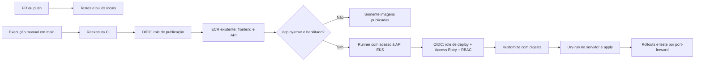

# GitHub Actions → ECR → EKS

Repositório: `willsreis/eks-lab-app`. Cluster: `eks-lab-dev`, região `us-east-1`, namespace `lab-dev`.
Esta etapa adiciona CI/CD à aplicação existente. O acesso continua por port-forward; não instala
Ingress, Gateway, TLS, observabilidade, HPA ou NetworkPolicy e não altera o Terraform.

**O EKS está desligado.** Os arquivos foram preparados e testados localmente. Nenhuma configuração
AWS/GitHub foi aplicada e nenhum workflow remoto foi disparado nesta entrega.

## Os dois workflows

| Workflow | Gatilho | O que executa | Precisa de AWS/EKS? |
|---|---|---|---|
| `CI` | PR, push em `main`, manual e chamada reutilizável | Testes Python, Kustomize, actionlint, Dockerfiles, builds e integração Docker | Não |
| `Publish images and deploy EKS` | Somente manual, em `main` | CI → publicação ECR → deploy opcional | ECR para publicar; EKS somente com `deploy=true` |



O workflow usa exatamente o commit selecionado da `main`, sem trocar para uma revisão mais nova
durante a execução. Runs de outras branches ficam ignoradas. Deploys são serializados e não são
cancelados automaticamente por uma nova execução. Actions externas estão fixadas por SHA de commit.

## 1. Recursos e decisões já previstos

A configuração local do repositório de infraestrutura prevê `eks-lab-dev/app` no ECR. O workflow usa
**esse único repositório**, com tags diferentes para frontend e API:

```text
ACCOUNT_ID.dkr.ecr.us-east-1.amazonaws.com/eks-lab-dev/app:frontend-COMMIT-RUN_ID-ATTEMPT
ACCOUNT_ID.dkr.ecr.us-east-1.amazonaws.com/eks-lab-dev/app:api-COMMIT-RUN_ID-ATTEMPT
```

Isso suporta tags imutáveis e novas tentativas de execução. O deploy usa `repository@sha256:...`,
não tags mutáveis. Os digests aparecem no summary do job de publicação. O digest pode representar
um índice multiarch; Kubernetes seleciona a variante compatível com o nó.

**Não é criada infraestrutura pela Action.** ECR e EKS precisam existir. Se o destroy do Terraform
também tiver removido o ECR, a publicação só funcionará após sua restauração pelo projeto de infraestrutura.
Imagens no ECR geram armazenamento e podem impedir o destroy do repositório com `force_delete=false`;
defina retenção/limpeza no projeto responsável. Os workflows não esvaziam o ECR.

As roles de publicação e deploy são separadas, específicas desta aplicação. A role de publicação
não altera EKS; a role de deploy não publica imagens nem altera configurações do cluster.
Nenhuma delas pode criar repositórios, roles, access entries ou alterar rede.

## 2. Configurar o GitHub agora

Em **Settings → Environments**, crie o environment `dev` e limite **Deployment branches and tags**
à branch `main`. Revisores são opcionais para este laboratório. Se habilitados, publicação e deploy
podem solicitar aprovação separadamente por serem jobs distintos.

Em **Settings → Secrets and variables → Actions → Variables**, crie estas **repository variables**:

| Variável | Valor |
|---|---|
| `AWS_ACCOUNT_ID` | Sua conta de 12 dígitos; o workspace de infraestrutura referencia `248385580901` — confirme na sua conta |
| `AWS_PUBLISH_ROLE_ARN` | `arn:aws:iam::ACCOUNT_ID:role/eks-lab-app-publish` |
| `AWS_DEPLOY_ROLE_ARN` | `arn:aws:iam::ACCOUNT_ID:role/eks-lab-app-deploy` |
| `ECR_REPOSITORY` | `eks-lab-dev/app` (padrão se omitida) |
| `EKS_DEPLOY_ENABLED` | **`false` enquanto o cluster estiver desligado** |
| `DEPLOY_RUNNER_LABELS` | `["self-hosted","linux","x64","eks-lab-dev"]`, conforme a seção do runner |

`DEPLOY_RUNNER_LABELS` precisa ser variável do repositório, pois é lida **antes** de o job entrar
no environment. Mantenha as demais no mesmo nível para simplificar; não crie valores conflitantes em `dev`.
Região e cluster estão fixados no workflow em `us-east-1` e `eks-lab-dev`.

Não são necessários `AWS_ACCESS_KEY_ID` ou `AWS_SECRET_ACCESS_KEY`. A autenticação usa tokens OIDC
de curta duração. [GitHub: OIDC com AWS](https://docs.github.com/en/actions/how-tos/secure-your-work/security-harden-deployments/oidc-in-aws).

## 3. Preparar OIDC e roles AWS

Esta é uma configuração administrativa, fora da Action. O workspace informa que o provider OIDC
do GitHub já é usado pela infraestrutura. Confirme sua existência; não crie uma segunda cópia:

```bash
export AWS_REGION=us-east-1
export AWS_ACCOUNT_ID="$(aws sts get-caller-identity --query Account --output text)"
aws iam get-open-id-connect-provider \
  --open-id-connect-provider-arn "arn:aws:iam::$AWS_ACCOUNT_ID:oidc-provider/token.actions.githubusercontent.com"
```

O provider deve usar URL `https://token.actions.githubusercontent.com` e audience `sts.amazonaws.com`.
Se não existir, sua criação pertence ao responsável por IAM. Não altere a trust policy da role de
Terraform para reutilizá-la nesta aplicação.

Templates entregues:

- [`aws/github-trust-policy.json`](aws/github-trust-policy.json): confiança restrita ao repo e environment `dev`.
- [`aws/publish-policy.json`](aws/publish-policy.json): push/pull das imagens no ECR específico e token do registry.
- [`aws/deploy-policy.json`](aws/deploy-policy.json): somente `eks:DescribeCluster` para o cluster alvo.

O `Resource: "*"` de `ecr:GetAuthorizationToken` é necessário porque essa ação não aceita escopo por
repositório. As operações de imagens ficam restritas ao ARN de `eks-lab-dev/app`. Não há permissões
de pull-through cache ou criação automática de repositório.
[AWS: permissões de publicação](https://docs.aws.amazon.com/AmazonECR/latest/userguide/image-push-iam.html).

Como as políticas IAM do seu ambiente são centralizadas em `policy-aws`, use os templates como entrada
para esse processo. Se optar por uma configuração manual de laboratório, os comandos equivalentes
abaixo criam **somente as duas novas roles da aplicação**. Não execute as duas formas em paralelo.

Na raiz deste repositório, com credenciais administrativas e o account ID já confirmado:

```bash
IAM_DOCS="$(mktemp -d)"
for policy in github-trust-policy publish-policy deploy-policy; do
  sed "s/ACCOUNT_ID/$AWS_ACCOUNT_ID/g" "docs/aws/$policy.json" > "$IAM_DOCS/$policy.json"
done

aws iam create-role --role-name eks-lab-app-publish \
  --assume-role-policy-document "file://$IAM_DOCS/github-trust-policy.json"
aws iam put-role-policy --role-name eks-lab-app-publish --policy-name publish-lab-images \
  --policy-document "file://$IAM_DOCS/publish-policy.json"

aws iam create-role --role-name eks-lab-app-deploy \
  --assume-role-policy-document "file://$IAM_DOCS/github-trust-policy.json"
aws iam put-role-policy --role-name eks-lab-app-deploy --policy-name describe-lab-cluster \
  --policy-document "file://$IAM_DOCS/deploy-policy.json"
```

Se a role já existir, inspecione seu gerenciamento antes de atualizar; os comandos de criação não
são idempotentes. Se mudar `ECR_REPOSITORY`, atualize também o ARN da policy. O `sub` da trust policy
pressupõe o subject OIDC padrão do GitHub; organizações com subject customizado devem usar o valor
real restrito a este repo/environment. O environment deve restringir `main`, pois o subject com
environment não contém a branch.

## 4. Preparar o runner de deploy

Build e publicação usam `ubuntu-24.04` hospedado pelo GitHub. O job de deploy é separado e usa
`DEPLOY_RUNNER_LABELS`. A configuração de infraestrutura inspecionada restringe o endpoint público
por CIDR e também oferece endpoint privado; um runner público com IP variável pode não alcançá-lo.

Escolha um runner Linux já existente que tenha acesso ao endpoint do cluster:

- Runner self-hosted em uma rede conectada à VPC, ou com saída pública já autorizada pela infraestrutura.
- Runner GitHub hospedado, **somente se** sua conectividade já estiver corretamente autorizada;
  nesse caso use `["ubuntu-24.04"]` em `DEPLOY_RUNNER_LABELS`.

Para self-hosted: em **Settings → Actions → Runners → New self-hosted runner**, siga os comandos
fornecidos pelo GitHub e adicione a label `eks-lab-dev`. Use um runner atualizado, com as bibliotecas
necessárias às Actions atuais (incluindo runtime Node embutido), Python 3.13 disponível pelo setup-python,
AWS CLI v2, `curl`, `jq`, `bash`, `sha256sum`, Git e acesso de saída a GitHub, STS, EKS e `dl.k8s.io`.
O instalador entregue baixa `kubectl v1.35.0` e valida seu SHA256. A arquitetura pode ser x64 ou arm64;
ajuste a label `x64` para `ARM64` em um runner ARM. Não é necessário Docker nesse job.

Não use esse runner de deploy para jobs de PRs não confiáveis. O CI de PRs roda exclusivamente nos
runners hospedados e não recebe OIDC. A criação de runner, VM, VPN ou liberação de rede não é feita
pelo projeto. A Action também não abre `0.0.0.0/0`, não muda `publicAccessCidrs` e não modifica o Terraform.
[AWS: acesso ao endpoint do cluster](https://docs.aws.amazon.com/eks/latest/userguide/cluster-endpoint.html).

## 5. Quando o EKS estiver disponível: bootstrap de acesso

Execute esta etapa como administrador do cluster. O modo de autenticação precisa ser `API` ou
`API_AND_CONFIG_MAP`; o Terraform inspecionado já declara `API`.

```bash
aws eks update-kubeconfig --name eks-lab-dev --region us-east-1
kubectl config current-context
aws eks describe-cluster --name eks-lab-dev --region us-east-1 \
  --query 'cluster.{status:status,version:version,authentication:accessConfig.authenticationMode}'

export AWS_DEPLOY_ROLE_ARN="arn:aws:iam::$AWS_ACCOUNT_ID:role/eks-lab-app-deploy"
aws eks create-access-entry --cluster-name eks-lab-dev --region us-east-1 \
  --principal-arn "$AWS_DEPLOY_ROLE_ARN" --type STANDARD \
  --kubernetes-groups eks-lab-app-deployers

kubectl apply -f k8s/base/namespace.yaml
kubectl apply -f k8s/bootstrap/github-actions-rbac.yaml
```

A Access Entry autentica a role; a Role/RoleBinding autoriza operações dentro de `lab-dev`.
Não associe `AmazonEKSClusterAdminPolicy`: não é necessária. Se a Access Entry já existir, inspecione
com `aws eks describe-access-entry` antes de alterá-la. Se o cluster for destruído/recriado, refaça
a Access Entry, o Namespace e o RBAC. Se a role IAM for recriada, a Access Entry antiga também precisa
ser recriada porque a identidade interna da role mudou.
[AWS: Access Entries com grupos Kubernetes](https://docs.aws.amazon.com/eks/latest/userguide/create-k8s-group-access-entry.html).

O RBAC permite aplicar Deployments/Services no namespace, observar rollouts e executar port-forward
para o smoke test. Não permite gerenciar Namespaces, RBAC, Secrets ou deletar recursos. A Role é
restrita a tipos de recursos em `lab-dev`, não por label; mantenha esse namespace dedicado ao laboratório.
O subrecurso `pods/portforward` tem `get` e `create` para o handshake WebSocket e a checagem adicional
de autorização no Kubernetes 1.35. [Kubernetes: transição para WebSockets](https://www.kubernetes.dev/resources/keps/4006/).

O workflow exclui o Namespace do YAML aplicado e não inclui o diretório `k8s/bootstrap` no overlay.
Isso evita conceder criação de recursos globais à role de deploy. O deploy manual original com
`kubectl apply -k k8s/overlays/dev` continua disponível para um operador com as permissões correspondentes.

Confirme também que a role **dos nós EKS** (ou a execution role do Fargate, se utilizado) consegue
baixar imagens ECR. A role da Action não é usada para pull pelos Pods. As roles de nós precisam das
permissões ECR apropriadas à infraestrutura; este repositório não as modifica.

## 6. Publicar sem o EKS ligado

Depois de commit/push destes arquivos, com OIDC e ECR disponíveis:

1. Abra **Actions → Publish images and deploy EKS → Run workflow**.
2. Selecione **main**.
3. Deixe **deploy desmarcado**.
4. Selecione a arquitetura dos nós previstos: o padrão `linux/amd64` corresponde aos `t3.small`
   configurados como exemplo no Terraform; escolha `linux/arm64` para Graviton ou ambas para um cluster misto.
5. Execute. O workflow roda os testes e publica as imagens; não consulta EKS, não gera kubeconfig e
   não agenda o job de deploy.

Equivalente com GitHub CLI:

```bash
gh workflow run deploy.yml --repo willsreis/eks-lab-app --ref main \
  -f deploy=false -f platforms=linux/amd64
```

Com `deploy=true` e `EKS_DEPLOY_ENABLED=false`, a execução falha na configuração antes de autenticar
na AWS/publicar. O cluster desligado não afeta o workflow CI.

## 7. Fazer o primeiro deploy

Quando cluster, ECR, OIDC, runner e bootstrap estiverem prontos:

1. Altere a repository variable `EKS_DEPLOY_ENABLED` para `true`.
2. Execute novamente o workflow na `main`, agora marcando **deploy**.
3. A publicação será repetida com tags exclusivas da nova execução.
4. O deploy consulta o estado `ACTIVE`, verifica conectividade/RBAC, renderiza digests, salva o YAML como
   artifact, executa `kubectl apply --dry-run=server`, aplica e aguarda os três rollouts.
5. Um port-forward temporário valida a página e `/api/info`, incluindo conexão Redis e namespace.

```bash
gh workflow run deploy.yml --repo willsreis/eks-lab-app --ref main \
  -f deploy=true -f platforms=linux/amd64
```

Para validar e acessar da sua máquina, também com conectividade ao EKS:

```bash
aws eks update-kubeconfig --name eks-lab-dev --region us-east-1
kubectl get deployments,pods,svc -n lab-dev
kubectl get endpointslices -n lab-dev
kubectl port-forward -n lab-dev svc/frontend 8080:80
```

Abra `http://localhost:8080`. A Action não publica o frontend na internet e não inicia um port-forward
permanente. O smoke test verifica uma réplica por conexão; os rollouts verificam a disponibilidade
das réplicas declaradas. Não altera `APP_VERSION=1.0.0`; o commit fica nas tags/labels OCI e no summary.

## 8. Diagnóstico e rollback

| Sintoma | Verificação |
|---|---|
| CI falha antes de publicar | Testes, Dockerfiles, YAML ou limites do teste local; não houve deploy. |
| OIDC `AccessDenied` | ARN/conta, provider, audience, `sub` exato e environment `dev`. |
| ECR `RepositoryNotFoundException` | `ECR_REPOSITORY` e existência do ECR após recriação da infraestrutura. |
| Job aguardando runner | Labels exatas, runner online e acesso permitido a este repo. |
| `ResourceNotFoundException` no EKS | Cluster ainda não foi recriado ou nome/região incorretos. |
| Timeout de `kubectl` | Rota, DNS, CIDR público/SG; OIDC sozinho não fornece conectividade. |
| `Unauthorized` / `Forbidden` | Access Entry da role correta, grupo e RoleBinding; Namespace bootstrap. |
| `ImagePullBackOff` | Digest, arquitetura e permissão ECR dos nós. |
| `Pending` / rollout excedeu tempo | Capacidade dos nós, eventos, requests e readiness/Redis. |

Falhas após a verificação do acesso coletam Pods, Services, EndpointSlices, eventos e logs no job.
O kubeconfig temporário e o port-forward são removidos ao finalizar. Não há rollback automático:
o apply pode ter atualizado parte dos recursos, e uma reversão automática esconderia o estado do exercício.

Para reproduzir um deploy anterior, baixe o artifact `eks-lab-app-COMMIT-ATTEMPT` da execução desejada
(retenção de 7 dias), revise e aplique com credenciais administrativas apropriadas:

```bash
kubectl apply --dry-run=server -n lab-dev -f eks-lab-app.yaml
kubectl apply -n lab-dev -f eks-lab-app.yaml
kubectl rollout status deployment/api -n lab-dev --timeout=180s
kubectl rollout status deployment/frontend -n lab-dev --timeout=180s
```

As imagens referenciadas precisam continuar no ECR. O artifact guarda manifests, não credenciais.
Não use **Re-run failed jobs** para misturar outputs de execuções antigas com imagens novas; inicie
uma nova execução completa para publicar e aplicar um par de imagens consistente.

## 9. Validar alterações nas Actions sem AWS

```bash
python3 -m venv .venv
.venv/bin/pip install -r api/requirements-dev.txt -r scripts/requirements.txt
PYTHONPATH=api .venv/bin/python -m pytest -q api/tests/test_api.py
.venv/bin/python -m unittest discover -s scripts/tests -v
kubectl kustomize k8s/overlays/dev
docker run --rm -v "$PWD:/repo:ro" -w /repo \
  rhysd/actionlint@sha256:b1934ee5f1c509618f2508e6eb47ee0d3520686341fec936f3b79331f9315667
docker build --check frontend
docker build --check api
docker build -t eks-debug-lab-frontend:1.0.0 frontend
docker build -t eks-debug-lab-api:1.0.0 api
bash scripts/ci/smoke-docker.sh
```

Os testes do renderizador verificam os digests exatos, os seis recursos permitidos e a ausência de
Namespace no deploy da Action. A integração Docker usa nomes temporários por processo e faz limpeza
ao terminar. O teste EKS só poderá ser confirmado com o cluster disponível.
